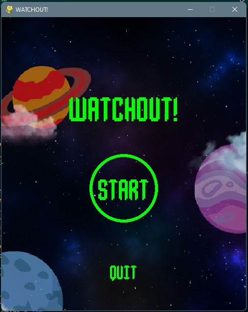
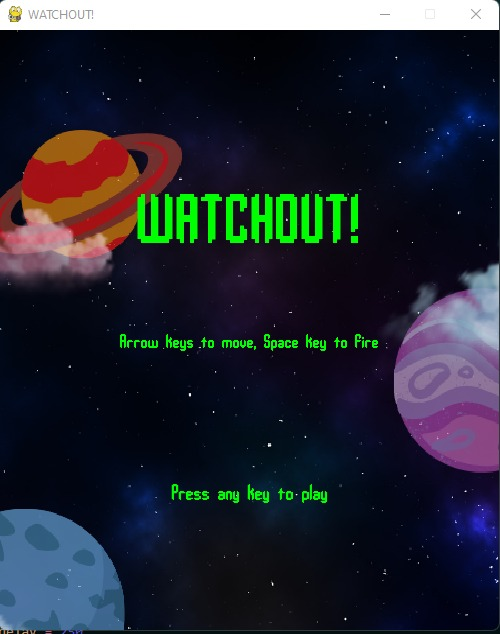
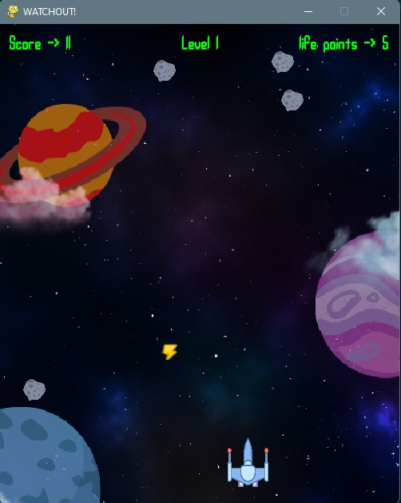
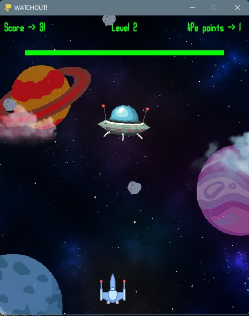
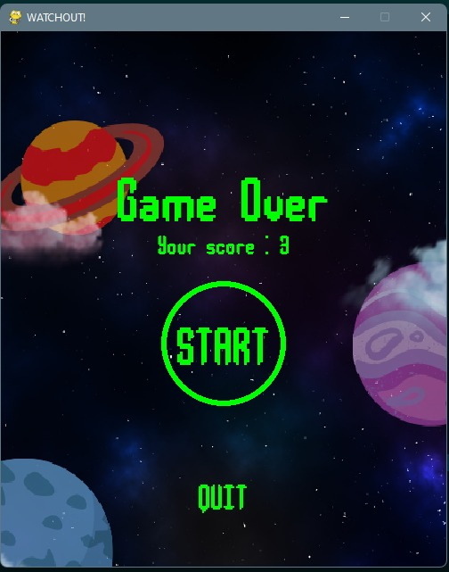
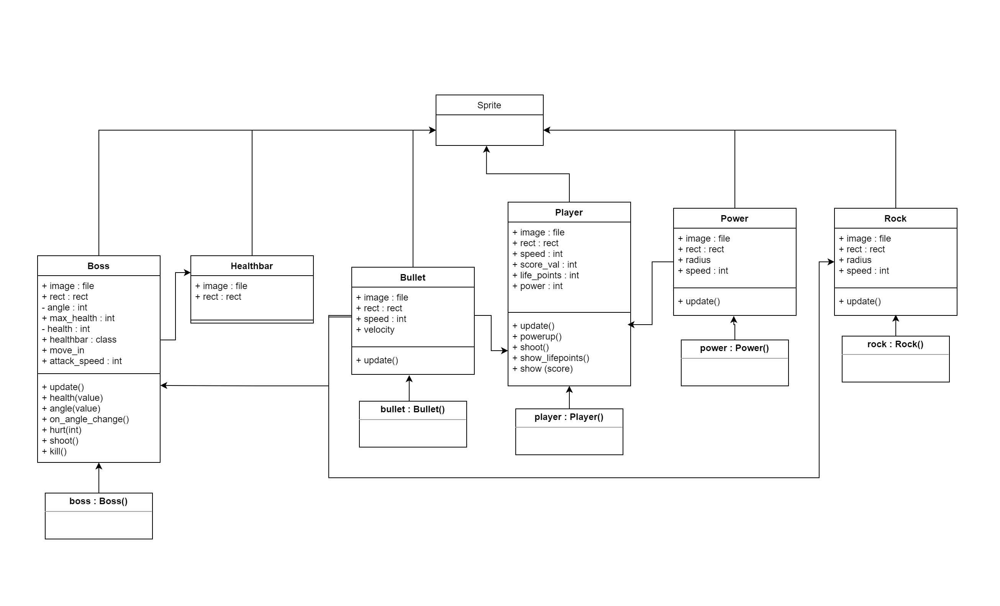

# Tubes_PBO
# WATCHOUT!
Pembuatan game watchout ini terinspirasi dari video game space invader yang mana pada video game ini terdapat sebuah pesawat yang akan melawan dengan cara menembaki elien atau musuh, namun pada game yang kami buat yaitu watchout kami mengganti musuh alien dengan menggunakan asteroid dan pesawat elien sebagai bos dari musuh.

## Nama dan NIM Anggota Kelompok
| Nama | NIM | Github |
| :---: | :---: | :---: |
| Faisal Khairul Fasha       | 120140158 | [faisalkfa](https://github.com/faisalkfa)                 |
| Faustine Elvaretta Tambila | 120140157 | [Faustineelvaretta](https://github.com/Faustineelvaretta) |
| Muhammad Hadi Arsa         | 120140150 | [HadiAr20](https://github.com/HadiAr20)                   |
| Syafira Wulandari          | 120140142 | [syafirawulandari](https://github.com/syafirawulandari)   |
| Hans Bonatua Batubara      | 120140131 | [Hans299](https://github.com/Hans299)                     |
| Indra Jaya Putra           | 120140059 | [indraphy](https://github.com/indraphy)                   |

## Dependencies:
pygame (https://www.pygame.org/) - Python game library
abc (Abstract Base Class) (Built-in)
typing (Type Hinting) (Built-in)

## How to play:
Press `←` to move left.
Press `→` to move right.
Press `↑` to move up.
Press `↓` to move down.
Press `SPACE` to fire.

## Installation:
1. Install Python 3.8+ (https://www.python.org/downloads/)
2. Create a new Python 3 virtual environment (https://docs.python.org/3/tutorial/venv.html)
    - If you already have a Python 3 virtual environment, you can use it.
    - "python -m venv venv" creates a new virtual environment in the current directory.
3. Activate the virtual environment:
    - "source venv/bin/activate" or "venv/Scripts/activate"
    - "deactivate" to deactivate the virtual environment.
4. Install the dependencies:
    - "pip install -r requirements.txt"
5. Run the game:
    - "python game.py"

## Documentation

## UML and Development:
<!-- Show UML.png from ./UML.png -->
### UML Diagram
<!-- Show UML.png from ./UML.png -->

